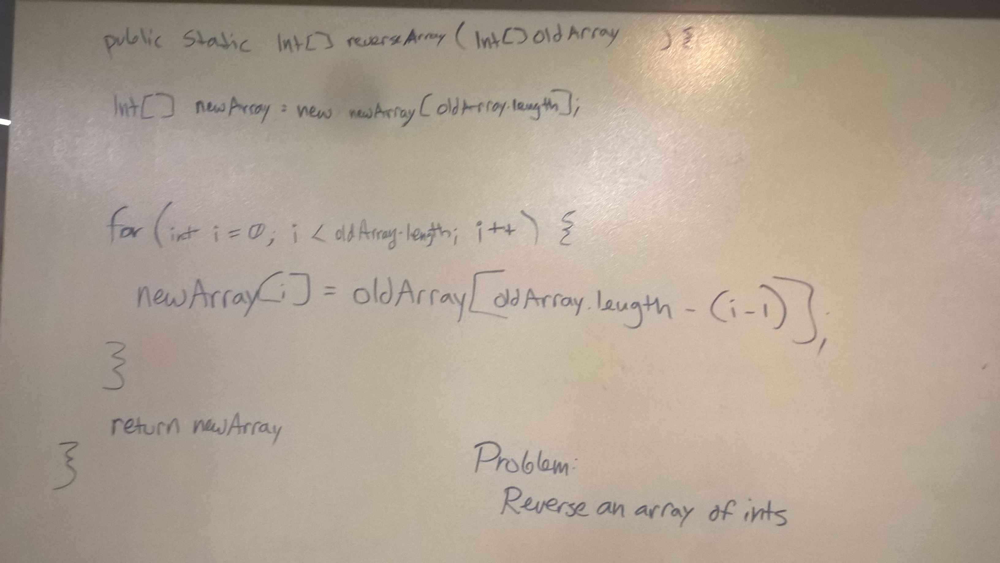
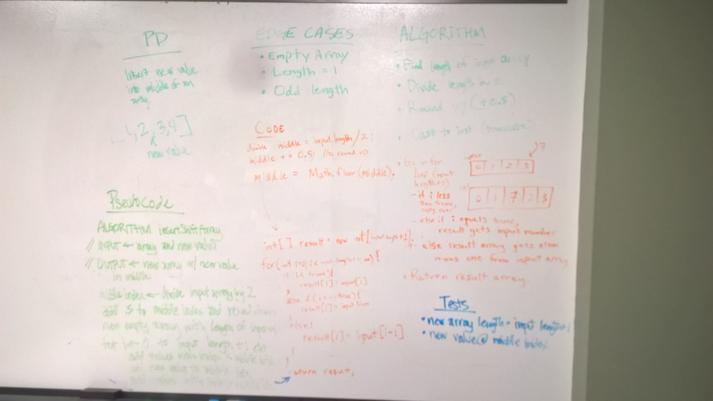
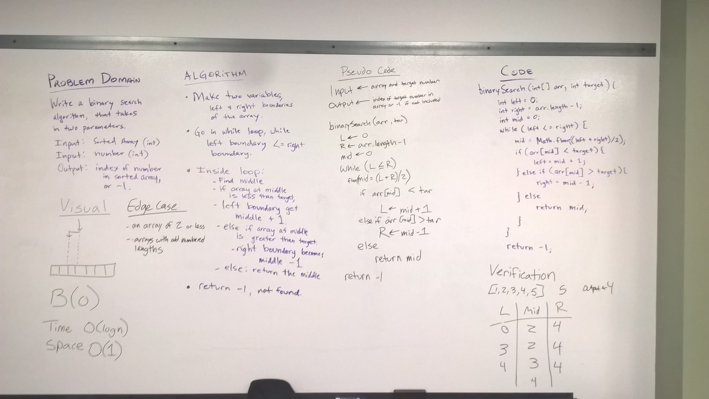

#Data Structures and Algorithms - Code Challenges

##Reverse an Array
Write a method that takes an array as an argument and returns that array in reverse order.

### Approach & Efficiency
The approach I took was to create a result array the same size as the input.  Then I looped through based on the size of
 the input, with the iteration starting at 0.  Since this is the first element of the result array, I needed to set it 
 to the last element of the input array.  To find the last element, then the next to last and so on.. I used the 
 formula: inputArray.length - 1 - i.

Big-O is linear, O(n).  It will grow linearly based on the size of the input.

### Solution

     
________________________________________________________

##Array Shift

### Approach & Efficiency
The approach I took was to make a result array which one element longer than the input array.  To find the middle I took the length of the input array and divided by two, added 0.5 for rounding, and then truncated the decimal off.  This gives the correct middle position for even, odd, and edge case length arrays like 0 and 1.

Once I knew the middle I entered a loop, where i starts at 0.  Inside the loop I checked if i was less than the middle position, where the array is copied 1:1.  Then I checked if i was equal to the middle position, in which case I copy in the number passed into the method.  Else the result array gets i -1 from input array, since this is where they are shifted.

Big-O is linear, O(n).  It will grow linearly based on the size of the input.

### Solution

     
 ________________________________________________________
 
 ##Binary Search
 Write a function called BinarySearch which takes in 2 parameters: a sorted array and the search key. Without utilizing any of the built-in methods available to your language, return the index of the array’s element that is equal to the search key, or -1 if the element does not exist.
 
 ### Approach & Efficiency
 The approach I took was to first read about this algorithm on Wikipedia.  We whiteboarded our solution, and had to adjust some of our boolean expressions to make sure we were following the algorithm and not going out of bounds.
 
 The algorithm works efficiently by effectively cutting the array in half each time it searches and fails to find the target number.  This is done by adjusting the variables left, right, and middle.  
 
 Time: O(log n)
 Space: O(1)
 
 ### Solution
 