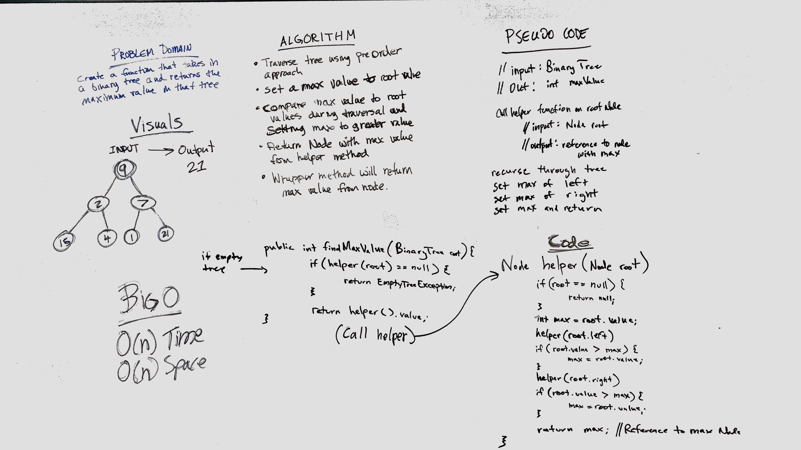

# Binary Tree - Find Maximum Value
* [Code](../src/main/java/tree)
* Parter: Dave Muench

For this challenge I used recursion to compare max values in the tree.  To do this I made a wrapper function where the recursion occurs, and a simple helper function to find the max values. 

## Methods

| Method               | Description                                                                                             | Big-O Time  | Big-O Space  |
|----------------------|---------------------------------------------------------------------------------------------------------|-------------|--------------|
| `findMaxValue()`     | Returns the largest int in the Binary Tree.  Throws an `IllegalStateException` if given an empty tree.  | O(1)        | O(1)         |
| `findMaxHelper()`    | Used to recurse through the Binary Tree and return the largest int.                                     | O(n)        | O(n)         |
| `max()`              | Helper function to return max of two int values.                                                        | O(1)        | O(1)         |

## Tests
I used jUnit testing under the following criteria:
* Empty tree - checked to return `IllegalStateException`
* One node tree
* Many node tree
* Uneven many node tree

# Solution

  

