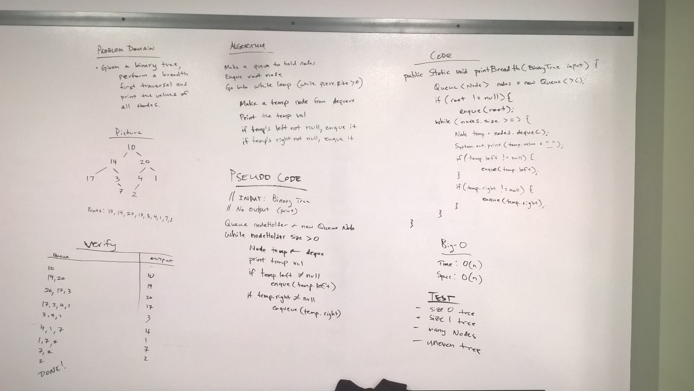

# Breadth First Print Tree
* [Code](../src/main/java/tree)

In this challenged I had to take in a `BinaryTree` as an argument, and print that tree using a breadth first traversal.

## Approach

My approach was to use iteration and a queue, where I iterate through the tree - adding subtrees to the queue.  Then as long as the queue size is greater than zero, I dequeue the next node and print the value.  I also included some logic to print a comma and a space between values, but not after the last value.

# Methods and Big-O

| Method           | Description                                                                                                         | Big-O Time  | Big-O Space  |
|------------------|---------------------------------------------------------------------------------------------------------------------|-------------|--------------|
| `breadthFirst()` | This is a static public function in the `BinaryTree` class which prints the list using a breadth first traversal    | O(n)        | O(n)         |

# Testing

Since this is a void function that prints, I utilized the `ByteArrayOutputStream` in order to match the expected output vs. the actual output.  I tested several types of trees:
* Empty tree
* One node tree
* Many node tree
* Many node, uneven tree

# Solution

  

