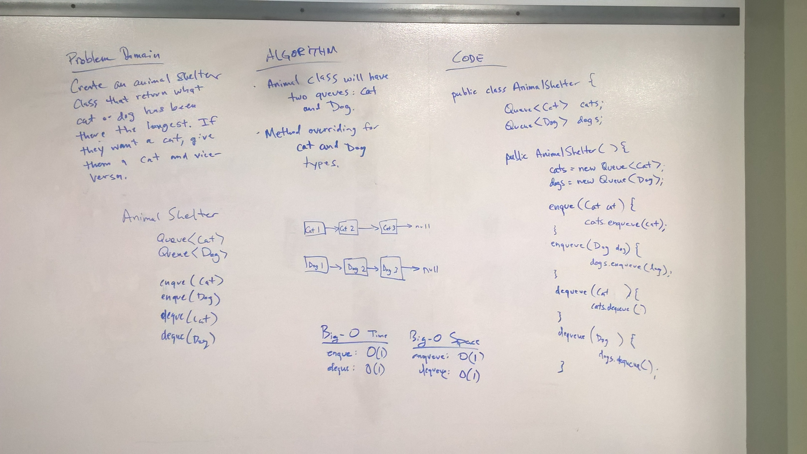

# FIFO Animal Shelter
* [Code](../src/main/java/fifoanimalshelter)

This code challenge was to implement the code which represented a First-In-First-Out Animal Shelter.  Specifically the Animal Shelter holds Dogs and Cats, and the must be enqueued and dequeued on this principle.

## Approach

To do this I wrote the ```FIFOAnimalShelter``` class to have only two fields:
* ```Queue<Cat> cats;```
* ```Queue<Dog> dogs;```

This allows me to overload the method for ```enqueue()``` depending on whether a Dog or a Cat is enqueued.  This means based on the parameter type of Dog or Cat, it will enqueue into the dogs or cats queue.

For ```dequeue(String preference)``` I just used conditional logic based on the parameter given to dequeue from either the dogs or cats queue.


## Methods and Big-O


| Method                             | Description                                             | Big-O Time  | Big-O Space  |
|------------------------------------|---------------------------------------------------------|-------------|--------------|
| ```enqueue(Cat cat)```             | Adds a Cat to the cats Queue                            | O(1)        | O(1)         |
| ```enqueue(Dog dog)```             | Adds a Dog to the dogs Queue                            | O(1)        | O(1)         |
| ```dequeue(String preference)```   | Removes a Cat or Dog based on the preference parameter. | O(1)        | O(1)         |


### Solution
  