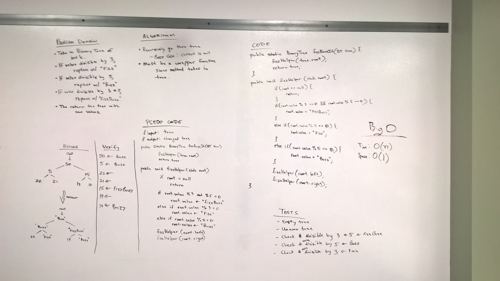

# FizzBuzzTree
* [Code](../src/main/java/fizzbuzztree)

In this challenged I had to take in a `BinaryTree` as an argument, and then determine determine weather or not the value of each node is divisible by 3, 5 or both, and change the value of each of the nodes:
* If the value is divisible by 3, replace the value with “Fizz”
* If the value is divisible by 5, replace the value with “Buzz”
* If the value is divisible by 3 and 5, replace the value with “FizzBuzz”

## Approach

My approach was to utilize a helper function which accepts the root node of the tree which it was called on.  It checks the values of the numbers and makes the replacement Strings where required, then recursively calls itself on the next left and right nodes.

One thing that is important for this challenge is to check if the number is divisible by 5 and 3 first (FizzBuzz), then do the others.

# Methods and Big-O

| Method           | Description                                                                                                | Big-O Time  | Big-O Space  |
|------------------|------------------------------------------------------------------------------------------------------------|-------------|--------------|
| `fizzBuzzTree()` | This is the public function which returns the altered list. The wrapper function is called from inside.    | O(n)        | O(1)         |

# Solution

  

