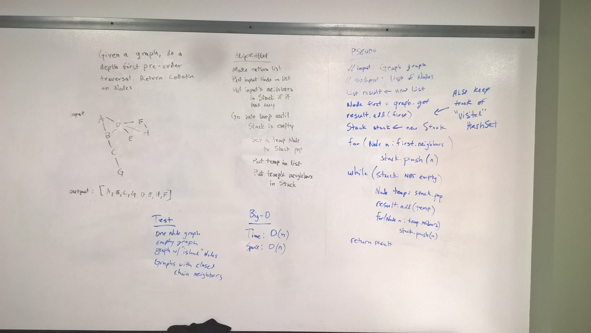

# Graph: Depth First Traversal
* [Code](../src/main/java/graph)

In this challenge I wrote a method called `depthFirst()` which takes in a graph and a starting node, and returns a list of nodes in depth first (pre-order) traversal.

## Approach

To perform a depth first pre-order traversal, I utilized a Stack.  Basically, the input node is pushed on the stack.  Then entering a loop which runs until the stack is empty, I pop off the top node, add it to the results list, and add all its neighbor nodes to the Stack.  This means we keep going deeper away from the input node before dealing with Nodes that are directly neighbors.

# Methods and Big-O

| Method           | Description                                                                                                                                                                                           | Big-O Time   | Big-O Space  |
|------------------|--------------------------------------------------------------------------------------------------------|--------------|--------------|
| `depthFirst()`   | Returns a List of Node objects in order of the depth first, pre-order traversal of the input graph.    | O(n^2)       | O(n)         |

# Testing

I tested this with graph with some complexity, a graph with only one Node, and on an empty graph.  Also it was tested with "island" nodes in the graph to make sure they get added to the output.

# Solution

  

