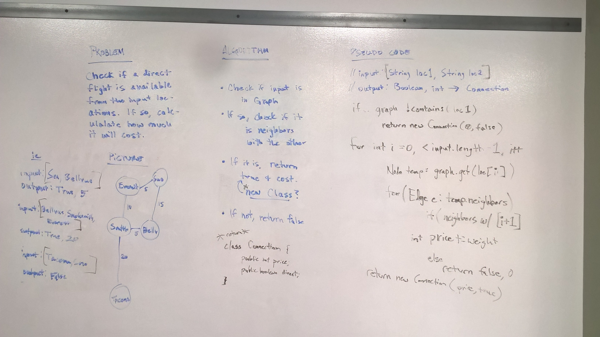

# Get Edges
* [Code](../src/main/java/graph)

In this challenge I wrote a method called `getEdge()` which takes in an array of city names. It then checks the graph to see if a full trip is possible with direct flights, and how much it would cost.

In order to accomplish this, I returned an object from a class I created called `Connection`.  A connection has a field for the boolean on whether the trip is possible, and an int for the price.  I override the hash function and the equals function so it can be checked in testing.

## Approach

My approach was to use an outer for loop that iterates over the city names in the input String array.  I then iterate over the nodes in the graph, and if a node is found with the same city name, it checks if it is neighbors with the next city in the input String array.  There is some other logic used in order to deal with edge cases and when to return a "false" Connection object.

# Methods and Big-O

| Method           | Description                                                                                                                                                                                           | Big-O Time   | Big-O Space  |
|------------------|-------------------------------------------------------------------------------------------------------------------------------------------------------------------------------------------------------|--------------|--------------|
| `getEdge()`      | Returns a `Connection` object with values `true` and `price` (represented by the sum of edge weights) if all cities in the input array are direct neighbors.  Else values will be `false` and `0`.    | O(n^3)       | O(1)         |

# Testing

The method is working with the following tests implemented:
* Two neighboring cities
* Three neighboring cities
* Five neighboring cities
* Two non-neighboring cities
* Five cities with one that is not neighboring
* Five cities with one that is not in the graph
* Only one city given in the input array

# Solution

  

