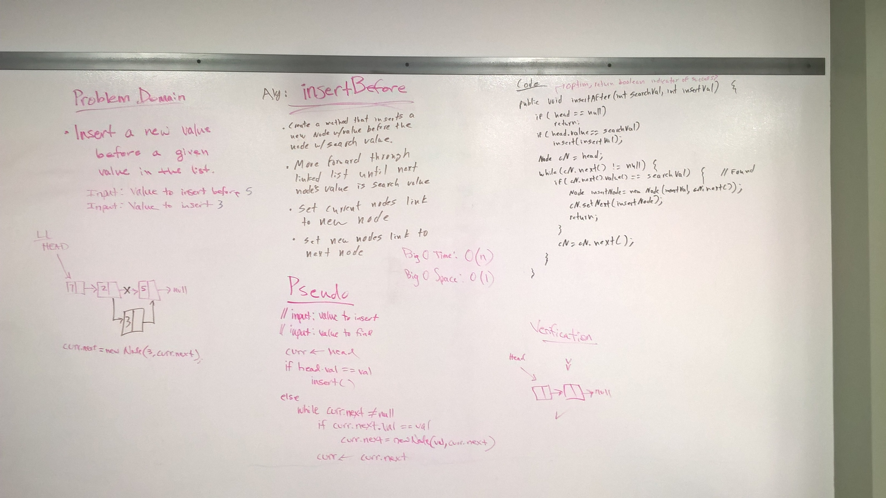
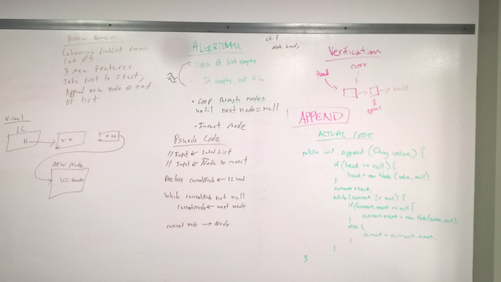

 ## LinkedList Insertions
In this code challenge I wrote the following methods to add to my LinkedList class: append(), insertBefore(), and insertAfter().  I also added the following helper functions: hasNext(), getHeadValue(), and getLastValue().  The last two I made to help test the code in the library, while hasNext() helps with iteration from within the class.  Lastly, I completed the stretch goal and wrote deleteValue(), which will delete the first value it finds in the list that matches the input value.
 
 ### Approach & Efficiency
For append(), my approach was to first check if the list was empty.  In that case, the head needs to be set to the new Node being appended.  Otherwise, I iterate through the list until I reach the last Node and append it to that last node's next.

My approach for insertBefore() was to first check if it was an empty list again, in which case I return false.  Then I check, if the head is the value being searched, because if it is, the head needs to be set to the new Node.  Otherwise I iterate through the list searching for the value.  The only note here, is that I check current.next for the value, because I don't want to go past the Node since it is being inserted before the value.  If the value is not found, I return false.

For insertAfter(), my approach is similar to insertBefore() except I allow current to get set to the Node I am checking since if it is the value, the new Node is being inserted after it.     
 
 append()
 Time: O(n)
 Space: O(n)
 
 insertBefore()
 Time: O(n)
 Space: O(n)
 
 insertAfter()
 Time: O(n)
 Space: O(n)
 
 
 ### Solution
  
       
  