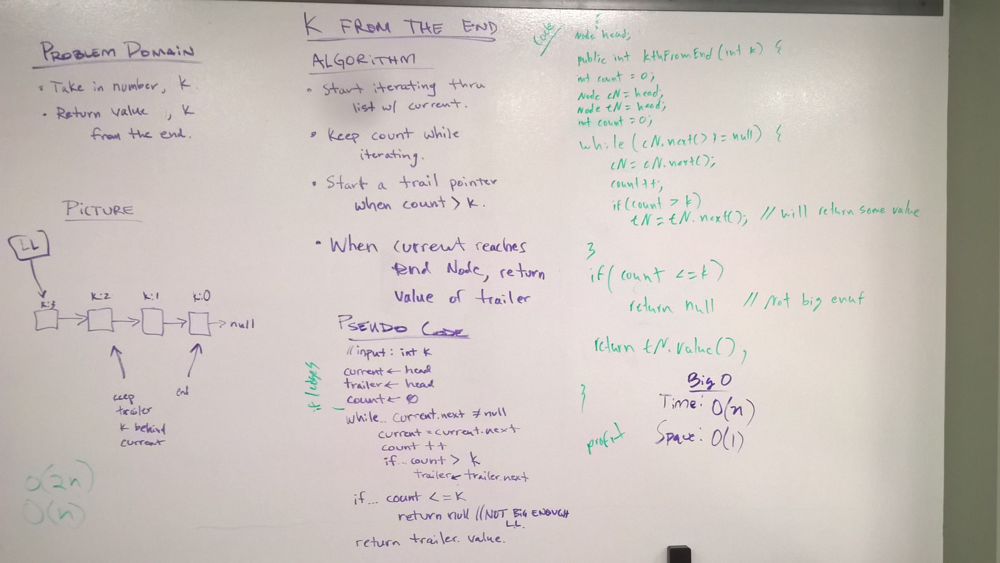

 ## LinkedList Insertions
In this code challenge I wrote the code for kFromEnd(int k).  This method takes in an int and returns the value of the Node that is k elements from the end of the list.  If the input, k, is too big or negative, then the method returns 'null' since the nodes hold String values.

I also completed the stretch goal, which was to write a method called findMiddleNode(), that returns the middle node in the linked list.
 
 ### Approach & Efficiency
The approach I took with kFromEnd() was to create another Node pointer, which I called follower.  The current Node pointer will iterate through the list as normal until it reaches the last Node, at which point it stops.  The follower Node pointer, will also iterate through the list but will stay k Nodes behind current.  When current reaches the end of the list, follower will be at the correct Node.  There is also some logic to make sure k isn't negative, and that it wasn't bigger than the size of the list.  In those cases, it is impossible to return a value.
 
 kFromEnd()
 Time: O(n)
 Space: O(1)
 
 With findMiddleNode(), my general approach was to create two pointers, where lead pointer would go through the list at two Nodes per step and the follower steps through Node by Node.  This way when the lead pointer reaches the end, the follower will be in the middle.  There is some other logic I wrote inside that loop to prevent null pointers, and to return the correct value.
 
 findMiddleNode()
 Time: O(n)
 Space: O(1)

 
 ### Solution
  