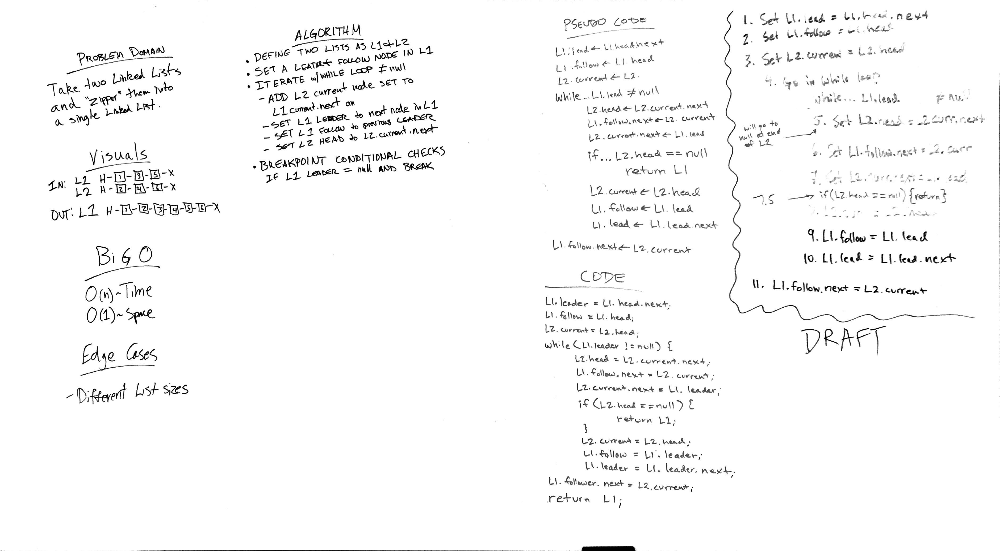

 ## LinkedList Merge
 ```public static LinkedList merge(LinkedList one, LinkedList two)```  
   
   
In this code challenge I wrote the code for merge(LinkedList one, Linked list two).  This is a static method that takes in two linked lists and merges them zipper style.  For example, after a merge the node order will be {list1, list2, list1, list2, ...}.
 
 ### Approach & Efficiency
The approach I took with the merge method was to first check if either of the two input lists were empty.  If one of them is empty, I just return the other list.  After that I create two pointers for the list one, a leader and a follower.  For list two, I just use the instance variable pointers current and head.  From that point, the basic idea is to enter a loop, keep the follower just behind the leader, and then insert the first node from the second list into the first list.  Inside the loop, if the head on the second list gets set to null, then the process is complete and I return list one.  Otherwise the loop continues until the leader gets set to null, and list one is returned.
 
 merge()
 Time: O(n)
 Space: O(1)
 
 ### Solution
  


