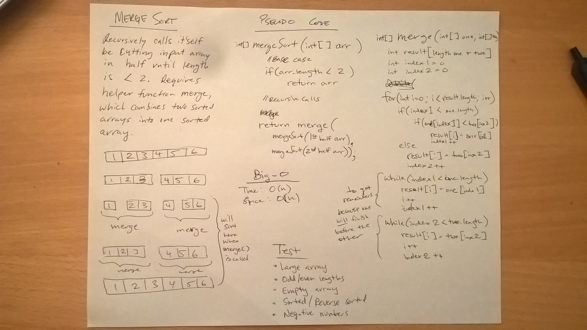

# Merge Sort
* [Code](../src/main/java/sort)

This code challenge was to write a function for merge sort, which takes in an unsorted array and returns the array sorted using an merge sort algorithm.  

The Merge Sort algorithm takes an array and splits it in half recursively until it only as two elements.  Then it uses a helper function `merge()` to sort the split arrays.

## Example

* Input: `[7, 5, 10, 1]`
* Output: `[1, 5, 7, 10]`

## Approach

The recursive part of the method calls itself by passing in the input array split in half repeatedly.  The base case for the recursive method is when the length of the array is less than 2.

## Methods and Big-O

| Method                    | Description                                                                                                                        | Big-O Time  | Big-O Space  |
|---------------------------|-----------------------------------------------------------------------------------|-------------|--------------|
| `mergeSort()`             | Takes the input array and sorts it used the merge sort algorithm.                 | O(n)        | O(n)         |

## Testing

I used JUnit testing on the following cases:
* An array with many elements.
* Odd and even length arrays
* An array with negative values.
* An empty array.
* An array with one element.
* An array with many elements in reverse order
* An array with many elements which is already in sorted order.

## Citations

* [Example of how to use Arrays.copyOfRange to split array](https://stackoverflow.com/questions/24169216/how-to-pass-part-of-an-array-as-function-argument-in-java)

## Solution

