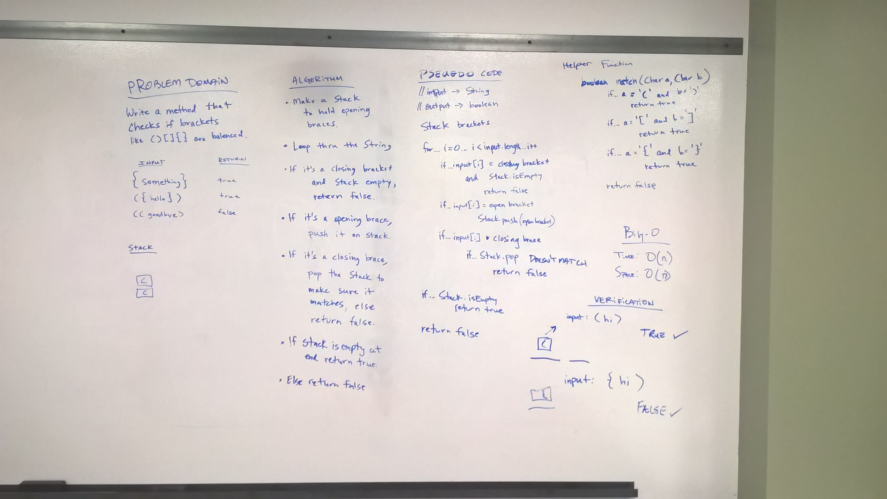

# Multi-Bracket Validation
* [Code](../src/main/java/multibracketvalidation)

For this challenge I created a method to determine if an input string contained matching/balanced brackets. The method returns a boolean.  It tests three types of brackets, round, curly, and square:```() {} []```.  

Here are some examples of input and what the method will output.

| Input                            | Output    | Notes                                                                                             |
|----------------------------------|-----------|---------------------------------------------------------------------------------------------------|
| ```no brackets```                | true      | No brackets are considered balanced, because there are no unbalanced brackets in the input string.|
| ```{}```                         | true      | May have one set of balanced brackets.                                                            |
| ```{}(){}```                     | true      | May contain several sets on balanced brackets.                                                    |
| ```()[[Extra Characters]]```     | true      | Extra characters do not affect the algorithm.                                                     |
| ```(){}[[]]```                   | true      | Brackets are balanced when there are balanced brackets inside of brackets.                        |
| ```{```                          | false     | No matching closing bracket.                                                                      |
| ```)```                          | false     | No preceding opening bracket.                                                                     |
| ```[}```                         | false     | Brackets are mismatched                                                                           |
| ```[({}]```                      | false     | Missing closing bracket.                                                                          |
| ```(](```                        | false     | For so many reasons.                                                                              |


## Approach

The approach I took to this problem was to create a Stack which opening brackets are pushed on, until such time that they can be checked against a closing bracket.  At this point, the method enters a loop which can go through the length of the string unless it short-circuits and returns false.

If at anytime there is a closing bracket and the stack is empty, the method will return false since that is always an unbalanced situation.

Otherwise, there is conditional logic to check if it's an opening bracket (to push onto the stack), or a closing bracket (to check against the top of the stack).

If the loop finishes and the stack is empty, it is a balanced bracket string, and will return true. Otherwise it will return false. 


## Big-O

Since this method has the potential to loop through all elements of the input string, Big-O is:

* Time: O(n)
* Space: O(n)

## Solution

