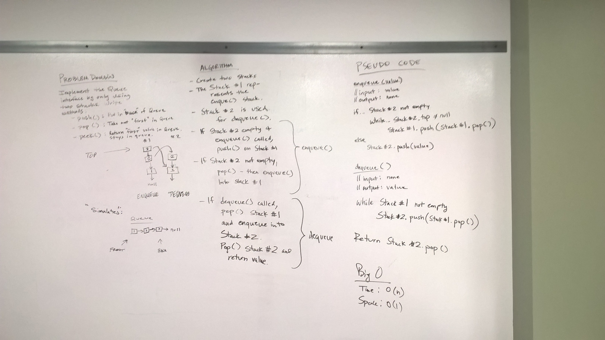

# Stacks and Queues
* [Code](../src/main/java/QueueWithStacks)

This code challenge was to implement a standard Queue interface with methods ```enqueue()``` and ```dequeue()```, but to do so only by using two stacks.

## Approach

To make this work, I call Stack #1 the enqueue stack, and call Stack #2 the dequeue stack.  To make these methods work, I move all items in each stack from one side to the other using the built in methods for a stack: ```push()``` and ```pop()```.


## Methods and Big-O

* ```enqueue()``` works by popping and pushing all values from Stack #1 to Stack #2.  Once Stack #1 is empty, ```push()``` is called on Stack #2 to insert the value on top the stack.

* ```dequeue()``` works by popping and pushing all values from Stack #2 to Stack #1.  Once Stack #2 is empty, ```pop()``` is called on Stack #1 to return the top value and remove it from the stack.


| Method               | Description                                                                      | Big-O Time  | Big-O Space  |
|----------------------|----------------------------------------------------------------------------------|-------------|--------------|
| ```enqueue()```      | Removes the front node of the queue and returns its value.                       | O(n)        | O(1)         |
| ```dequeue()```      | Adds a new value to the back of the queue.                                       | O(n)        | O(1)         |


### Solution
  