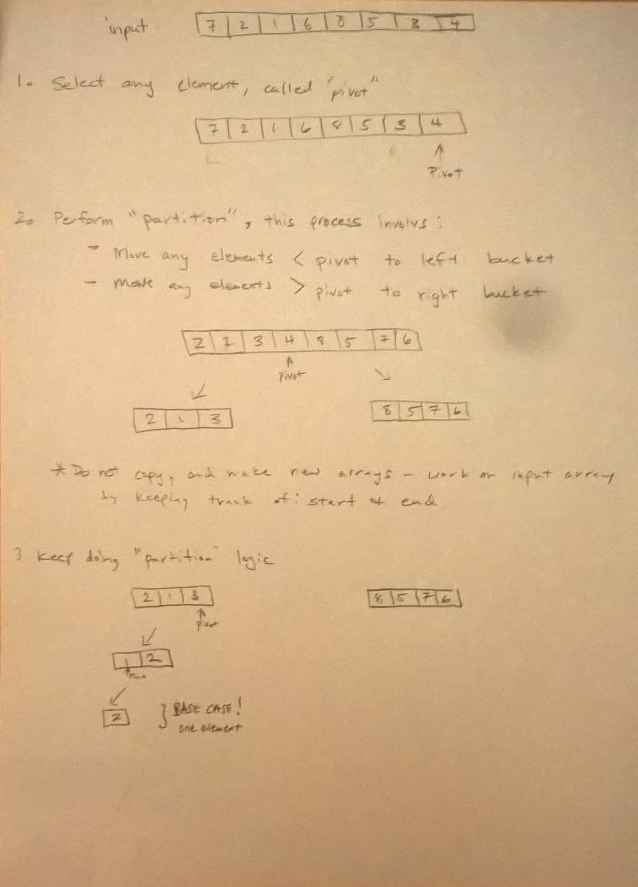
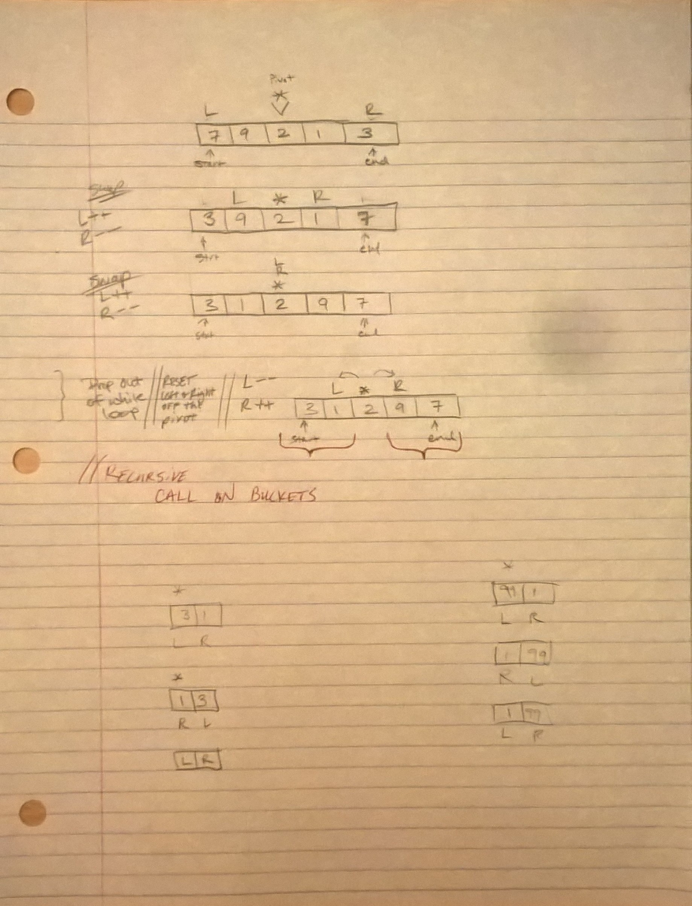

# Quick Sort
* [Code](../src/main/java/sort)

This code challenge was to write a function for quick sort, which takes in an unsorted array and returns the array sorted using a quick sort algorithm.  

The Quick Sort algorithm takes an array and splits it into two buckets, a less than bucket and a greater than bucket.  Using pointers to keep track of where the buckets start and end, it puts values on the left or right side based upon a pivot value, which I set as the middle of the bucket.

## Example

* Input: `[7, 5, 10, 1]`
* Output: `[1, 5, 7, 10]`

## Approach

The recursive part of the method calls itself by passing in the input array and pointers to keep track of where each bucket starts and ends.  It recursively sorts these buckets to a less than side and a greater than side, until the length is less than 2.

This approach sorts the array in place, so its return type is void.

## Methods and Big-O

Since, `quickSort()` will split the input array of n length until it reaches less than size 2, the time complexity is: log n.  However, it can also iterate through the array n times.  Since it sorts it in place, and no copies are made, the space complexity is constant.

| Method                    | Description                                                                                                                        | Big-O Time  | Big-O Space  |
|---------------------------|-----------------------------------------------------------------------------------|-------------|--------------|
| `quickSort()`             | Takes the input array and sorts it used the quick sort algorithm.                 | O(n log n)  | O(n)         |

## Testing

I used JUnit testing on the following cases:
* An array with many elements.
* Odd and even length arrays
* An array with negative values.
* An empty array.
* An array with one element.
* An array with many elements in reverse order
* An array with many elements which is already in sorted order.

## Citations

* [Great video by mycodeschool on YoutTube which explains the algorithm using pictures and high level pseudo code.](https://www.youtube.com/watch?v=COk73cpQbFQ)

## Solution

