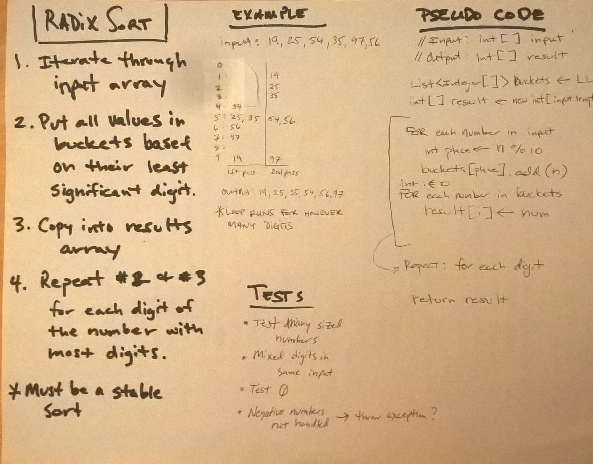

# Radix Sort
* [Code](../src/main/java/sort)

This code challenge was to write a method for Radix Sort, which takes in an unsorted array of integers and returns the array sorted using a Radix Sort algorithm.  

The Radix Sort algorithm first puts integers to buckets by their least significant digit.  From that order, it continues putting them into buckets based on their next significant digit.  This process must be a stable sort for the algorithm to work.

## Example

* Input: `[7, 5, 107, 10, 55, 1]`
* Output: `[1, 5, 7, 10, 55, 107]`

## Approach

My approach was to first put the input values into buckets based on their least significant digit.  Afterwards, I move the buckets over to the results array.  This is done in case it's finished, but if it's not, the order is preserved while the buckets are reset for the next iteration.

This approach returns a new array, preserving the input array.  However, it could be modified to sort the array in place.

## Methods and Big-O

The time complexity based on the number of digits, d, in the largest number, the base, b, of the number system, and the number of items, n, in the input array.

| Method                    | Description                                                                       | Big-O Time  | Big-O Space  |
|---------------------------|-----------------------------------------------------------------------------------|-------------|--------------|
| `radixSort()`             | Takes the input array and sorts it used the radix sort algorithm.                 | O(d·b·n)    | O(n)         |
| `getMaxDigits()`          | Helper that returns the number of digits in the number with the most digits inside the array. | O(n)        | O(1)         |

## Testing

I used JUnit testing on the following cases:
* An array with one, two, three, four and five digit numbers.
* Arrays with different digit lengths.
* An empty array.
* An array with one element.
* An array with many elements in reverse order
* An array with many elements which is already in sorted order.

## Citations

* [Creating an array of lists.](https://stackoverflow.com/questions/8559092/create-an-array-of-arraylists)
* [Information on clearing lists.](https://howtodoinjava.com/java/collections/arraylist/empty-clear-arraylist/)
* [Random.org for generating random number sequences for testing](https://www.random.org/)

## Solution

