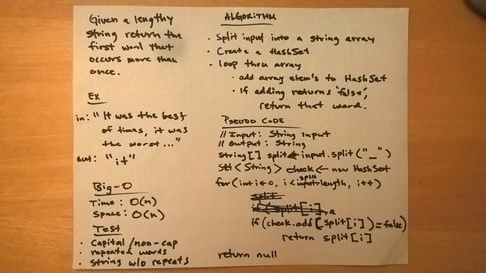

# Repeated Word Challenge
* [Code](../src/main/java/repeatedword)

In this challenge, the input is a "lengthy" String. It could be something like a paragraph in a book, or potentially even larger. The challenge is to return the first word which occurs in the string more than once.

## Approach

My approach was to utilize a HashSet. The functionality of a HashSet's function `add()` is to return false if the HashSet already contains the same value. In order for this to work, there were a few steps involved in preparing the given input String:
1. Split the input by spaces and put it into an array.
2. Iterating through that array, put the words into lower case form.
3. Use Regex to remove any trailing punctuation, like periods or commas.
4. If `add()` returns false, return that word since it is already in the HashSet. 

If after iterating over the input string no duplicate words are found, the method will return `null`.

## Methods and Big-O

| Method                    | Description                                                                              | Big-O Time  | Big-O Space  |
|---------------------------|------------------------------------------------------------------------------------------|-------------|--------------|
| `findFirstRepeatedWord()` | Public static method that will return the first repeated word from an input string.      | O(n)        | O(1)         |

## Testing

I used JUnit testing on the following cases:
* With a lengthy input string containing repeated words.
* Where the first repeated words are of different case.
* Where one of the first repeated words has trailing punctuation.
* An input string with no repeated words.
* An input string with no spaces.
* An empty input string.

## Solution

  

