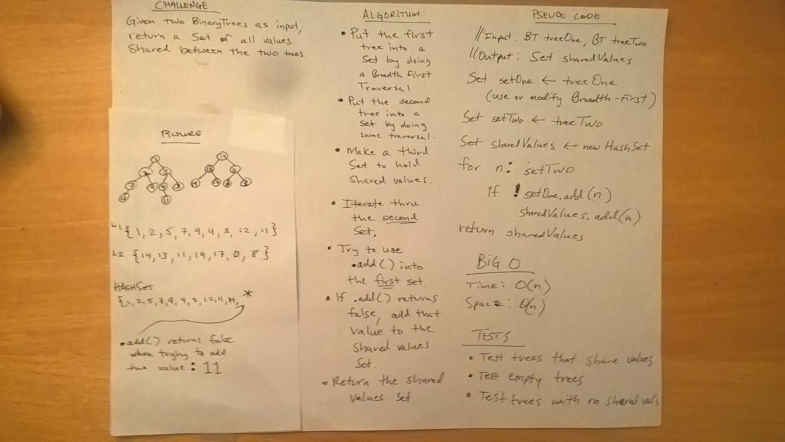

# Tree Intersection
* [Code](../src/main/java/tree)

In this challenge, the inputs are two BinaryTrees. The method is required to return a Set of values that appear in both trees.

## Approach

My approach was to utilize a HashSet. The functionality of a HashSet's function `add()` is to return false if the HashSet already contains the same value.  Therefore I made the first tree into a HashSet with my helper function which does a Breadth First Traversal.  I do the same for the second tree, and also make a third Set which will contain the shared values between the two trees.  The algorithm then follows these steps:

1. Iterate through HashSet #2 (containing Tree two's values).  
2. Using `.add()`, try to put the value from HashSet #2, into HashSet #1. 
3. If `.add()` returns false (it will return false if that value is already in the set), add that value to the Set of shared values.
4. Return the shared values Set.

## Methods and Big-O

There are several loops in the algorithm, but only one is used at any given time.  I make copies of values in tree one, tree two, and any shared values.

| Method                    | Description                                                                                                                        | Big-O Time  | Big-O Space  |
|---------------------------|------------------------------------------------------------------------------------------------------------------------------------|-------------|--------------|
| `treeIntersection()`      | Public static method that takes in two BinaryTrees, and will return a set of Integers shared between both trees.                   | O(n)        | O(n)         |
| `integerTreeToSet()`      | Helper method that takes in one BinaryTree and returns a Set of that tree's values by doing a breadth first traversal.             | O(n)        | O(n)         |

## Testing

I used JUnit testing on the following cases:
* Trees with many branches and many shared values.
* Trees with no shared values (should return empty Set).
* Empty trees (should return empty Set).

## Solution

